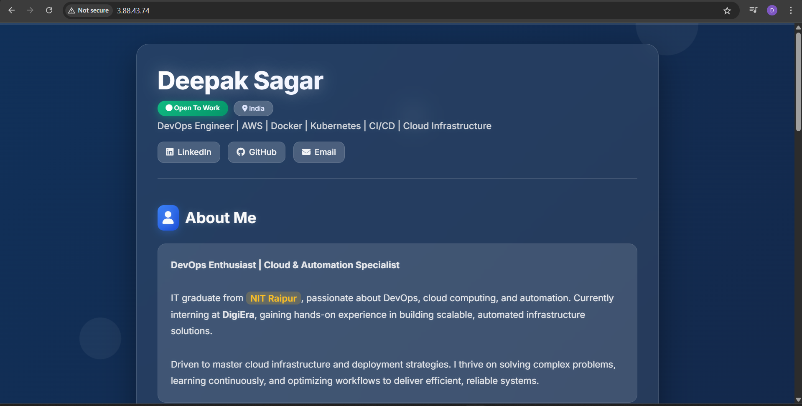
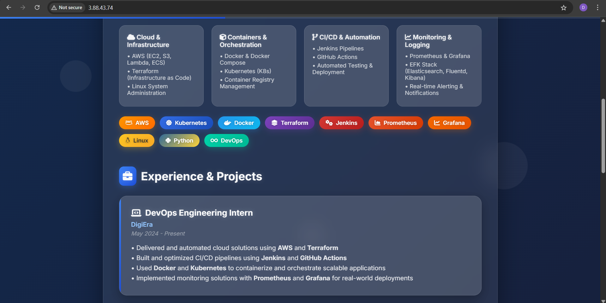

---

# Ansible Role: Static Portfolio Web Deployment on RHEL

## Description

This Ansible role is designed to **install Apache HTTP Server (httpd)** on a **RHEL-based Linux system** and deploy a **static portfolio website**. It is ideal for simple personal or demo projects where you want to showcase a static HTML-based portfolio through an automated provisioning process.

> 🔧 This role is optimized for Red Hat Enterprise Linux and its derivatives (such as CentOS, Rocky, AlmaLinux, etc.).

## Features

- Installs `httpd` (Apache)
- Ensures the service is started and enabled on boot
- Deploys a static website to `/var/www/html/`
- Fully automated setup with minimal input

## Screenshots

Below are preview screenshots of the deployed website:

### Home Page


### Portfolio Section



## Requirements

- Target host must be RHEL/CentOS/Rocky/AlmaLinux
- Ansible 2.9 or later
- Root privileges (via `become: true`)

## Role Variables
This role currently does not require any custom variables. All defaults are set within the role.


## License
MIT

## Author Information

This role was created by [Coding4Deep](https://github.com/Coding4Deep) as a simple demo for Ansible role development and deployment.

---

```

Let me know if you’d also like to generate the required `meta/main.yml`, `tasks/main.yml`, or sample static website files to complete this role.
```
